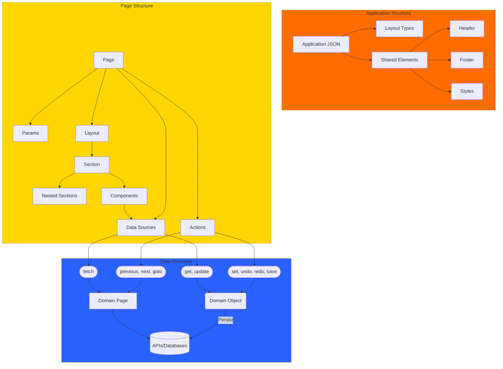

# OA Pages 

## Overview

OA Pages is a framework for building dynamic web applications, leveraging JSON-based configurations to define the structure and behavior of the application.




---

## Key Concepts

- **Pages**: Defined through JSON with various configurations to build dynamic applications.
- **Application Structure**: Elements shared across pages, including styles, headers, footers, and layouts.
- **Page Structure**: Defined in navigation JSON, application meta, or APIs, consisting of sections, components, layout, and parameters.
- **Sections**: Basic layout units, supporting features like sliders or tabs.
- **Components**: Reusable UI elements, such as HTML or videos, embedded within sections.
- **Metadata**: JSON configuration specifying page properties, layouts, components, and actions.

## Overview

---

## Features

OA Pages uses JSON-based constructs to define the application's structure and behavior. Below are the details:

### Application Structure


```json
{
  "app": {
    "layout": "sticky-sidebar"
  },
  "page"{ 
    "layout": {},
    "header": {},
    "sidebar": {},
    "footer": {},
    "styles": {}
  }
}
```
#### Layout Types:

`app.layout`

**Sidebar Layout**
- Code: `sticky-header` (default)

**Sidebar Layout**
- Code: `sticky-sidebar`
- Description: Features a collapsible or fixed sidebar alongside the main content area.
- Use Case: Admin panels, dashboards, or apps with navigation and settings.

**Masonry Layout**
- Code: `masonry`
- Description: Displays content in a masonry-style grid, where items are arranged optimally based on available space.

- Use Case: Image galleries, portfolios, or Pinterest-like layouts.
- [ref](https://www.youtube.com/watch?v=8zm0ruyp3-I)

Full-Screen Hero Layout
- Code: `hero`
- Description: Features a full-screen hero section with a call-to-action, followed by additional content.
- Use Case: Landing pages, promotional sites, or apps with a strong visual focus.
- [ref](https://www.reddit.com/r/UI_Design/comments/12zwok8/landing_page_design_hero_section/?rdt=55872)

**Centered Content Layout**
- Code:`centered`
- Description: Centers the main content vertically and horizontally, often used for login pages or focus areas.
- Use Case: Login/registration pages, landing pages, or focus-intensive apps.
- [ref](https://codepen.io/JacobLett/full/obqXMZ)

#### Styles
Global styles can be defined at the application level and referenced across pages.

#### Shared Elements
- **Header**
- **Footer**
- **Layout**

---

### Page Structure

Page structure includes:
- **params**
- **actions**
- **data**
- **layout**
- **components**

**Definition Sources**:
- Navigation API or JSON file
- Application meta

**Sample Page Structure**:
```json
{
  "params": {},
  "actions": [],
  "data": [],
  "layout": {},
  "components": []
}
```

---

#### Layout
A collection of `sections` defining the visual structure.

#### Section
Sections are layout blocks containing:
- **class**: Styles the section and its components.
- **style**: Inline styles for customization.
- **code**: Section identifier (used as a `div` ID).
- **permissions**: Controls visibility based on user roles.
- **components**: A collection of components rendered in the section.
- **sections**: Nested sections defining layouts.
- **type**: Determines the rendering style (e.g., `slider`, `tab`).

**Examples**:
1. **Slider Section**: Renders child sections as slides.
   ```json
   {
     "type": "slider",
     "sections": [
       {
         "components": [{ "control": "html", "value": "Slide 1" }]
       },
       {
         "components": [{ "control": "html", "value": "Slide 2" }]
       }
     ]
   }
   ```

2. **Tabbed Section**: Uses child section headers as tab labels.
   ```json
   {
     "type": "tabbed",
     "sections": [
       {
         "container": { "header": { "icon": "fa-home", "title": "Home" } },
         "components": [{ "control": "html", "value": "Body of Home" }]
       },
       {
         "container": { "header": { "icon": "fa-settings", "title": "Settings" } },
         "components": [{ "control": "html", "value": "Body of Settings" }]
       }
     ]
   }
   ```

#### Components
Components are reusable UI elements rendered within sections.

**Properties**:
- **control**: Defines the component type (e.g., `html`, `video`).
- **options**: Customization attributes for the component.
- **value**: Data rendered by the component.
- **container**: Specifies the rendering context.
- **permissions**: Visibility controlled by user roles.

---

### Example Components

#### HTML Component
   ```json
   {
     "section": "banner-container",
     "control": "html",
     "value": [
       "<h1>Build custom apps 10X faster</h1>",
       "Low-code development platform for secure and scalable applications."
     ]
   }
   ```

#### Video Component
   - **YouTube Video**:
     ```json
     {
       "control": "video",
       "options": { "provider": "youtube" },
       "value": "uNhjgEBb4BU"
     }
     ```
   - **Video File**:
     ```json
     {
       "control": "video",
       "options": { "provider": "file", "style": { "width": "100%" } },
       "value": "/assets/videos/demo.mp4"
     }
     ```

#### Uploader Component
   ```json
   {
     "control": "uploader",
     "options": {
       "service": "connect",
       "collection": "data/upload",
       "field": "file"
     }
   }
   ```

#### Table Component:

It supports transforms


#### JsonViewer
- Standalone component for displaying JSON data in a collapsible tree view
- Features:
  - Customizable styling
  - Skip empty fields option
  - Sort by key option
  - Field filtering
  - String length limiting
  - Array and object type detection

#### Calendar
- Standalone calendar component with event support
- Features:
  - Month navigation
  - Event integration
  - Day selection
  - Custom styling options
  - Legend support

---

### Data Sources

Data sources enable integration with APIs or backend services.

**Examples**:
1. **Search Data**:
   ```json
   {
     "code": "customers",
     "type": "search",
     "config": {
       "service": "sales",
       "collection": "organizations",
       "query": { "type": "customer" },
       "page": { "limit": 10 }
     }
   }
   ```

2. **Get Resource**:
   ```json
   {
     "code": "business",
     "type": "get",
     "config": {
       "service": "sales",
       "collection": "organizations",
       "id": ":code"
     }
   }
   ```

---

### Domain Object and Page

#### Domain Object
Supports:
- **set**, **undo**, **redo**, **refresh**, **save**

#### Domain Page
Supports pagination:
- **previous**, **next**, **goto**, **items**

**Usage in Actions**:
```json
"actions": [
  { "code": "refresh", "value": "employee" },
  { "code": "undo", "value": "employee" },
  { "code": "save", "value": "employee" }
]
```

---

### Core Components


### Project Configuration

#### Development Setup
- Uses Angular 17 with standalone components
- ESLint configuration for code quality
- EditorConfig for consistent coding style
- Environment configurations:
  - Production
  - QA
  - Local development

#### Build Configurations
- Production build with optimization
- QA environment support
- Local development mode
- SSR (Server-Side Rendering) support
- Asset management for fonts and styles

#### Scripts

---

## Releases

### Version 2.4
- Added `domain-page` for pagination.
- Added `domain-object` for state management.
- Improved table and list components for shared domain-page integration.

### Version 2.3
- Added file uploader control.

### Version 2.2
- Introduced action control.
- Added permissions to sections and components.

### Version 2.1
- Revamped page rendering mechanism.
- Enhanced styles and application structure.

### Version 2.0
- Upgraded to Angular 17.
- Introduced standalone components and new architecture.

---

## Setup

### Development Server
Run `npm run local` to start the server. Access the application at `http://localhost:4210/`.

---

## TODO

- Implement [Spectral](https://github.com/stoplightio/spectral) for validating Page Meta and Application Meta.
